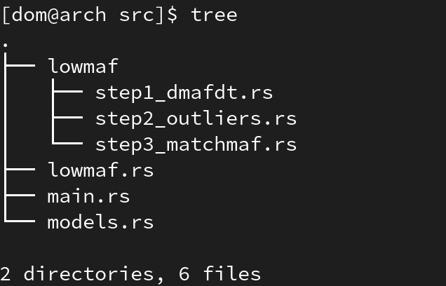
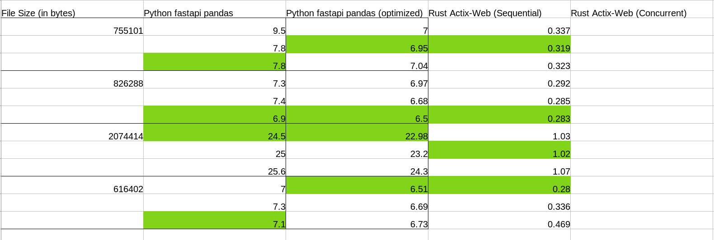
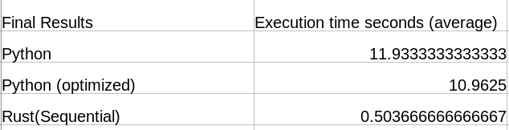
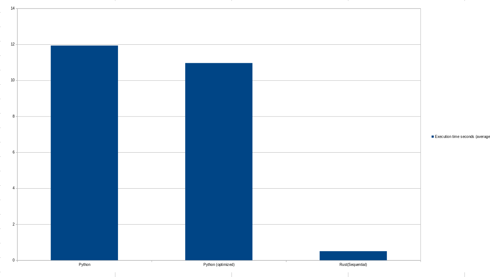

# Purpose
The Closed Loop Maf Scaling feature of OpenEJ ( Handled by Service-Lowmaf* ) is the most performance intensive feature of the site at this time.
The Service-Lowmaf feature was originally written in python using fastapi as the web server and pandas for data analysis.
We originally chose python because of its simplicity as a language which made the development process quick and robust, allowing us to quickly push new features.

However it quickly became clear that python was very limited in terms of performance, and when analyzing "large" files, on the size of 1MB or larger, the user would have to wait a substantial ammount of time for their request to be processed. 
We decided that rather try to optimize our python code, which would be systemically limited by the python platform, we would refactor the code into Rust.
Rust gives us vastly higher performance, and still many of the same advantages of python. Moving forward Rust should be the standard for any performance intensive OpenEJ services. We would also like to experiment with concurrency and data analysis libraries such as Polars to further optimize the already ```blazingly fast``` Rust code.

# Architecture 
We organized this project in a way that allows for adaptability in the future. 

Following rust best practices, ```main.rs``` is only used for creating the actix web server, and declaring our routes. 
main.rs currently contains two routes :
1. ```/api/analyze/0``` which calls the main runner funciton in ```lowmaf.rs```
2. ```/heartbeat/0/``` which returns a 200 code indicating that the server is live

In ```lowmaf.rs```, the main calculations for the lowmaf data analysis are organized. The main runner function ```begin()``` calls functions for each step of the process, located in the ```./lowmaf/``` directory. 

Finally ```models.rs``` is used to store all of the neccessary structs, and constants used throughout this service
# Performance
We ran several tests in prodcution between the pyhton, and rust based lowmaf services.
The nature of the tests included testing files of multiple sizes, multiple times for each type of service. 
We first tested the python fastapi service, and then optimized the code and tested again. We then tested the sequential rust service. Down the line, if we add concurrency we will test that as well. 

The times shown below for each service are the execution times of each request. 


It is clear that even with optimizations, python is still ```blazinly slow``` and cannot compare to the ```blazingly fast``` rust code. 

Here are the average execution times for each service:


If it wasnt already clear enough heres a graph to put the final nail in the coffin:


At this point im not sure if it makes sense to even add concurrency to this service, given the already massive speedup over python. But it may be useful once we scale up, and we will leave this as an option moving forward. 